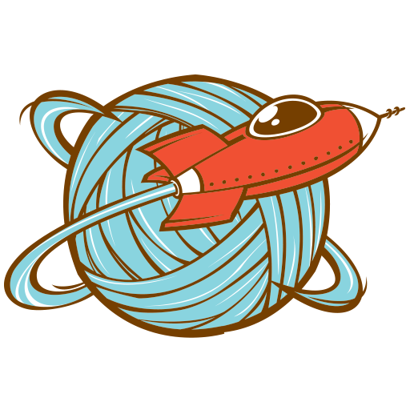

  

 

# Clew : event log outlier detection

This application groups all text events up to the specified time and identifies abnormal events in the problem period

## Dependencies

- Python
- Huggingface
- Hdbscan
- Torch
